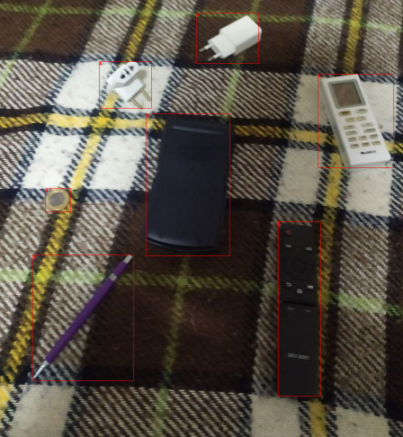
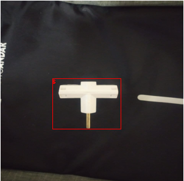
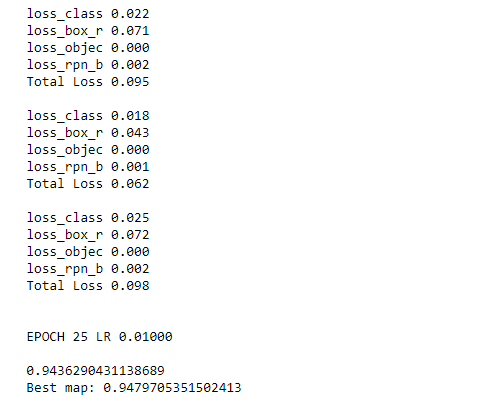
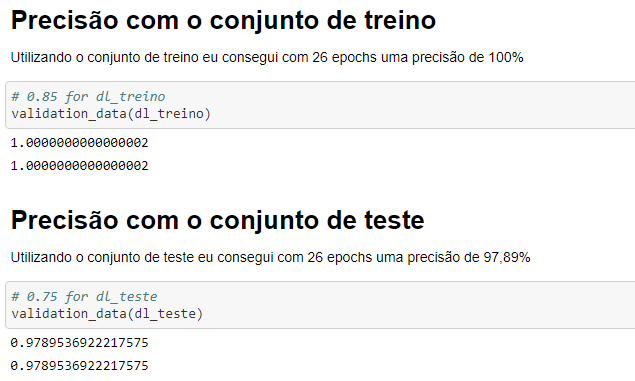
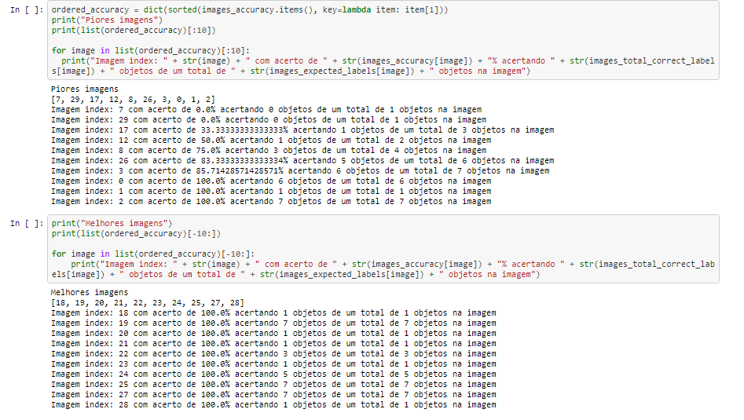
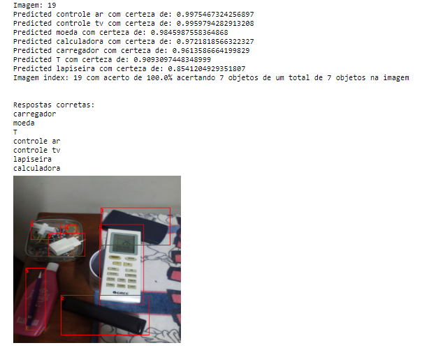
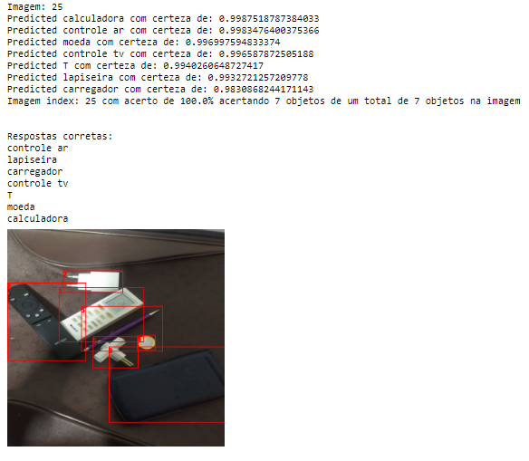
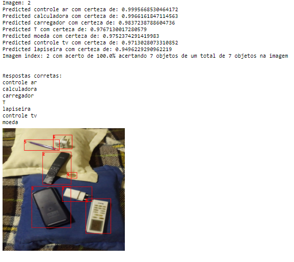

<h1 align="center">Object Detection</h1>

<h4 align="center"> 
	Concluído ✔️
</h4>

---

   <h2 align="center">Tópicos 📋</h2>

   

   
   - [Objetivo 📖](#objetivo-)
   - [Makesense 🛠️](#makesense-%EF%B8%8F)
   - [Precisão 🏁](#precisão-)
   - [Analisando predições 📲](#analisando-predições-)
   - [Conclusão 🤔](#conclusão-)

   

---

<h2 align="center">Objetivo 📖</h2>
   

  Utilizando um conjunto de dados de 200 imagens, o objetivo deste software é localizar e classificar 7 objetos diferentes em diversas imagens, utilizando o algoritmo ResNet. os objetos utilizados no dataset disponilizado foram: 'T', 'Carregador', 'Controle de ar condicionado', 'Controle de TV', 'Calculadora', 'lapiseira', 'Moeda de 1 real'.

---

<h2 align="center">Makesense 🛠️</h2>

   

Para rotular todos os objetos utilizados em todas as imagens, utilizamos o site **[Makesense](https://makesense.ai)** para a criação das labels. abaixo exemplos de como ficam algumas imagens depois da utilização do Makesense.

 

 

   

---

<h2 align="center">Precisão 🏁</h2>

   

Utilizando um conjunto de treino com 140 imagens, e um conjunto de validação com 30 imagens para verificar a precisão, foi possívil atingir uma precisão de 94,79% utilizado-se de 26 epochs para treinamento.

 

 

   

---

<h2 align="center">Analisando predições 📲</h2>

 
Utilizei como threshold a confiaça de 70% na predição do objeto, para avaliar a precisão do meu algoritmo acertando os objetos. Após ordenar todas as iamgens do conjunto de teste por score, cheguei no seguinte resultado para as 10 melhores imagens e as 10 piores imagens:

   

---

<h2 align="center">Conclusão 🤔</h2>

 
  Após o tunning e treino alcançamos os seguintes resultados:
  
  A precisão do modelo nos dados de teste é de: 97,89%

  A precisão do modelo nos dados de validação é de: 94,79%

  Alcançamos um resultado muito bom para a localização e classificação dos objetos, mesmo este sendo um dataset pequeno e com baixa qualidade. Então dá para se ter noção do qual poderoso o algoritmo é de quais resultados podemos alcançar com um dataset mais robusto.
  Abaixo algumas imagens com a localização e classificação feita pelo algoritmo:
  

 

   link: **[COLAB](https://colab.research.google.com/drive/1v3Sc_HNnxpFqW3pFE1sqQSXgbM8BLPrL?usp=sharing)**
   link: **[DATASET](https://drive.google.com/drive/folders/19AsIHBmWQtU0sdpYrMyqaJKbOpfmNeuW?usp=sharing)**

---

## 💪 Como contribuir para o projeto

1. Faça um **fork** do projeto.
2. Crie uma nova branch com as suas alterações: `git checkout -b my-feature`
3. Salve as alterações e crie uma mensagem de commit contando o que você fez: `git commit -m "feature: My new feature"`
4. Envie as suas alterações: `git push origin my-feature`

---

   ## 🦸 Autor

   Este projeto foi desenvolvido com o ❤️ por **[@Ícaro Coêlho](https://github.com/icarogga?tab=following)** 👋🏽 Entre em contato!
   
    

---

## 📝 Licença

Este projeto esta sobe a licença [MIT](./LICENSE).

---

